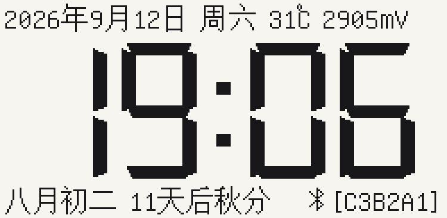
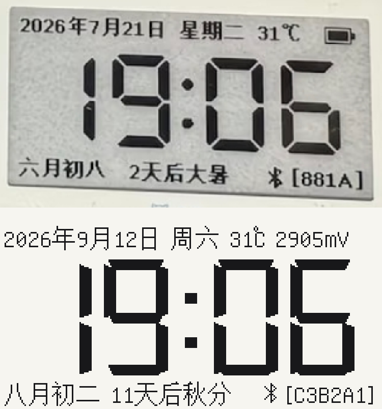

# Nowa-213R-N 电子价签固件

把汉朔（Hanshow）**Nowa-213R-N** 2.13" 三色电子价签改造成一个**低功耗 BLE 时钟**，
并持续压低它每分钟刷新一次的能耗。

基线是 [atc1441/ATC_TLSR_Paper](https://github.com/atc1441/ATC_TLSR_Paper)，
烧录工具用 [pvvx/TlsrComSwireWriter](https://github.com/pvvx/TlsrComSwireWriter)。

> ⚠️ **个人研究项目，非汉朔官方固件。** 刷机可能变砖。动手前请先读
> [DEVELOPMENT.md](DEVELOPMENT.md)，尤其是「烧录后必须整根拔 USB」那节。



*上图由 `tools/render_screen_preview.py` 离线渲染（250×122，3 倍放大），不依赖实机 ——
改 UI 的第一步就跑它，别为几个像素来回刷机。*

同一张图的实际排布与它模仿的面板放在一起：



*上：参考面板（`docs/images/reference-panel.png`，用户提供）；下：本固件渲染。
对照图由 `python tools/render_screen_preview.py --compare docs/images/reference-panel.png`
重新生成 —— 渲染与对照用的是同一个模型，两边不可能各自漂移。*

## 硬件

| 部件 | 型号 | 说明 |
|---|---|---|
| MCU | Telink **TLSR8359F512ET32** | 32-bit RISC-V + BLE，64 KB SRAM，512 KB Flash |
| 屏驱 | **SSD1680** | 250×122 BWR 三色，无灰阶；列主序，1 字节 = 8 竖像素 |
| 面板 | HINK-E0213A31 | 2.13"，VCI 由 PC5 经 P-MOS 开关直接取电池轨道 |
| NFC | 复旦微 **FM11NC081** | I2C 标签（PC0 SDA / PC1 SCL / PC4 IRQ / PC6 CS） |
| LED | PA7 蓝 / PD2 红 / PD3 绿 | |
| 供电 | 2×CR2450 **并联** = 3 V | ≈1000 mAh。**耐压上限 3.6 V，可充锂电不可直连** |

> 屏驱是 **SSD1680**，不是 SSD1675。早期研究笔记判断错了，勘误与代价见
> [docs/nowa213_flash_research.md](docs/nowa213_flash_research.md) 顶部。

## 版本状态

当前 **v14.0**。完整历史与每个发布固件的 SHA256 见 [CHANGELOG.md](CHANGELOG.md)。

| 版本 | 日期 | 内容 |
|:--|:--|:--|
| v2.0 | 09-04 | 时间 ↔ 图片每分钟交替；用户图存 Flash，断电不丢 |
| v3.0 | 09-04 | 修 BLE 上传图片的两个显示问题 |
| v4.0 | 09-10 | 改为**纯时钟模式**（不再交替显示图片）|
| v5.0 | 09-10 | 省电：广播间隔 1 s → 10 s；夜间 0:00–5:59 完全不刷 |
| v6.0 | 09-10 | 局部窗口刷新 —— ❌ **写错了驱动文件，无效** |
| v7.0 | 09-11 | 局部刷新搬进真正在跑的 `epd_bwr_213.c`，只驱动 137/296 栅极 |
| v8.0 | 09-11 | 局部刷新波形 50 → 40 帧 |
| v9.0 | 09-11 | 修「价签 1 分钟 = 现实 2 分钟」的走时 bug |
| v10.0 | 09-11 | 右下角显示固件版本号 |
| v11.0 | 09-11 | 温度/电池加死区（治「整屏无规律黑闪」）；右上角 `B` → 蓝牙图标 |
| v12.0 | 09-11 | **诊断版**：把 4 个全刷触发源的计数器画到屏上 |
| v13.0 | 09-12 | **结案**：黑闪已消失（实测 `T=0`），摘掉屏上计数器，界面恢复干净 |
| **v14.0** | **09-12** | **版面重做**：公历 + 农历 + 节气 + 节气倒计时；手绘大时钟；局部窗口 137 → **92** 栅极 |

> **问题的结局**：v11.0 的温度死区就是真正的修复。诊断版运行近一天读数
> `H9(饱和) T0 B1 L2` —— 温度一次都没越过死区，一天只剩约 21 次全刷（此前约 500 次）。
>
> v13.0 出厂时计数器已下屏，但 `app.c` 里的计数逻辑**保留着**：若黑闪再出现，
> 把 `epd.c` 的 `EPD_USE_REFRESH_DEBUG` 改成 `1` 重新编译即可，无需重写。
> 离线预览可用 `python tools/render_screen_preview.py --debug 18,0,1,2` 直接看排版。

### v14.0 版面

```
┌──────────────────────────────────────────┐
│ 2026年9月12日 周六 31℃ 2905mV            │  行1 Dialog 16
│                                          │
│        19:06                 ← 手绘 7 段  │  行2 高 76 px
│                                          │
│ 八月初二 11天后秋分        ⚡ [C3B2A1]    │  行3 符文字槽 173..180
└──────────────────────────────────────────┘
       ↑ 局部刷新窗口 玻璃 x 140..231 = 栅极 187..278（92/296 = 31%）
```

三件事值得单独说：

1. **大时钟是手绘的，不是字体。** 字号 40 的 `DSEG14` 宽高比 0.85，要 68 px 高就得
   289 px 宽（超屏）；等比缩到能放下只剩 55 px 高。手绘 h68 / w40 / 厚 8 / 斜 4 / 距 8
   → **187 px**。代价是整行重写了两个字体的用法，收益是旧的 GFX 字体（`Dialog_plain_16`
   / `Special_Elite_Regular_30` / `DSEG14_..._40`）不再被任何代码引用，被 `gc-sections`
   整体裁掉 —— 镜像 91260 B（v13.0）→ **82460 B（v14.0）**，反而小了 8.6 KB。
2. **数字占固定槽位，不按串宽居中。** 这不是审美选择：局部刷新只驱动「分钟两位」所在
   的栅极带，而如果有任何一位数字的宽度会影响别人的位置，`1` 进出分钟位就会把整串推来
   推去，窗口就得覆盖整个时钟（214 列）而不是 92 列。固定槽位把这个前提**变成结构性
   事实**，`tools/verify_v14_layout.py` 用「枚举全部 1440 个 HH:MM、逐拍 diff 帧缓冲」
   来证明实际变化的列恰好就是窗口驱动的列。
3. **窗口带是竖直的，会连带重画行 1。** 栅极线驱动意味着带内所有行都被重写，所以
   行 1 落在 x 140..231 的电压值必须逐分钟稳定 —— `app.c` 用 `shown_mv` / `shown_temp`
   在整点全刷时拍快照，局部刷新期间一直显示快照值。否则末位数字漂移会被每分钟重绘，
   宽度从 9→10 还会留下错位残影。

## 项目结构

```
nowa213/
├── atc1441_src/Firmware/   # 固件源码（含 src/ 、build_firmware.py）
├── TlsrComSwireWriter/     # pvvx SWS 烧录工具 + 救砖固件
├── firmware_releases/      # ★发布固件（文件名带版本/日期/大小）
├── docs/                   # 研究笔记、接线速查、版面推导、文档配图
├── tools/                  # 全部脚本：版面镜像 / 离线校验 / 屏幕预览 / 表生成
│   └── archive/            # 已退役的校验脚本（附退役原因）
├── web_flasher.html        # 浏览器 WebBLE 刷机
└── web_uploader.html       # 浏览器 WebBLE 传图 + 对时
```

细节见 [DEVELOPMENT.md §1.3](DEVELOPMENT.md)。

## 快速开始

```bash
# 0) 改版面/改 UI 之前，先让离线校验器说话（不需要工具链）
python tools/verify_v14_layout.py        # 期望 "64 checks passed, 0 failed"
python tools/render_screen_preview.py    # 期望 previews/screen_v14_zoom3.png

# 1) 编译（需先备好 tc32 工具链，见 DEVELOPMENT.md §1.2）
cd atc1441_src/Firmware
python build_firmware.py
# 产物：out/ATC_Paper.elf + ATC_Paper.bin

# ⚠️ 编译后必查 SRAM 边界（链接器不报溢出，越界 = 上电即砖）
./tc32_windows/bin/tc32-elf-nm.exe out/ATC_Paper.elf | grep _end_bss_
# 必须 < 0x850000（v14.0 实测 0x84efa1，余量 4191 B）

# 2) 烧录（-t 3000 是必选项，COM 口以本机为准）
cd ../../TlsrComSwireWriter
python TLSR825xComFlasher.py -p COM6 -t 3000 wf 0 <固件>.bin

# 3) 彻底断电重启：拔掉 CH340 的 USB 整根线，等 2~3 秒再插回
```

## 工具

`tools/` 下的脚本都遵循同一条规矩：**坐标和常量只在源码里写一遍，脚本一律解析源码，
绝不硬编码第二份** —— 所以改了固件却忘了改脚本，脚本会报 FAIL 而不是默默放过。

| 脚本 | 用途 |
|---|---|
| `epd_face_model.py` | **版面唯一镜像**：逐行对应 `epd_font.c` / `epd.c` / `calendar.c`，解析 `epd_layout.h` 的宏与生成的字体/历法表。预览与校验都跑在它上面，所以两者不可能各自漂移 |
| `render_screen_preview.py` | **改 UI 前先跑它**：离线渲染整屏 PNG。`--window` 加窗口底纹，`--compare <照片>` 与参考面板对照，`--debug H,T,B,L` 画诊断计数器 |
| `verify_v14_layout.py` | 64 项断言：格子边界、窗口=实际变化列的精确并集（枚举全部 1440 个 HH:MM 逐拍 diff）、行 1 最宽串、农历 9131 天逐日走查、以及**否定性自检**（把每个已修 bug 重新植入，确认对应断言真的会 FAIL）|
| `gen_v14_tables.py` | 生成 `font_unifont.h` / `font_chars.h` / `calendar_data.h`（Unifont 子集 + 节气 Meeus + 农历表 + 手绘符文），并把编译进去的位图打进头文件注释 |
| `verify_part_lut.py` | 断言 153 字节 LUT 布局 |
| `verify_time_catchup.py` | 断言时钟追补逻辑（含 268 秒回绕边界）|
| `epd_image_tool.py` | BMP → 帧缓冲 → 可选直写 Flash |
| `gen_epd_image.py` / `bmp2epd_framebuffer.py` | 生成 EPD 测试图与 BLE 指令序列 |

`tools/archive/` 放着 5 个已退役的校验脚本（v5–v13 时代的产物）。它们不是坏掉了 ——
恰恰相反：在 v14.0 下它们**照样打印 PASS，却在断言固件早已不写的窗口**。一个永远不会
失败的检查比一个失败的检查更危险，所以退役并逐条记录在
[tools/archive/README.md](tools/archive/README.md)。

## 文档

| 文档 | 内容 |
|---|---|
| [DEVELOPMENT.md](DEVELOPMENT.md) | 完整开发指南：环境、编译、烧录、代码地图、BLE 协议、Git 流程、踩坑清单 |
| [CHANGELOG.md](CHANGELOG.md) | 版本历史、每版的根因分析、发布固件 SHA256 |
| [docs/v14-reference-design.md](docs/v14-reference-design.md) | v14.0 版面的推导过程：参考面板逐项测量、字形度量、宽度预算、被否掉的方案 |
| [docs/nowa213_wiring_flash_summary.md](docs/nowa213_wiring_flash_summary.md) | 接线与刷机速查 |
| [docs/nowa213_flash_research.md](docs/nowa213_flash_research.md) | 硬件研究笔记（NFC / 硬件扩展 / 电池方案）|

## 上游来源与许可

本仓库是下面两个项目的**衍生作品**，二者均以 MIT 发布。它们的 `.git` 已移除，
内容 vendor 进本仓库统一版本管理。

| 上游 | 用途 |
|---|---|
| [atc1441/ATC_TLSR_Paper](https://github.com/atc1441/ATC_TLSR_Paper) | TLSR8359 价签固件基线（`atc1441_src/`）|
| [pvvx/TlsrComSwireWriter](https://github.com/pvvx/TlsrComSwireWriter) | SWS 单线烧录工具（`TlsrComSwireWriter/`）|

本仓库自身的改动同样以 **MIT** 发布，见 [LICENSE](LICENSE)。
上游的版权声明保留在其各自目录内。

## 免责声明

刷机可能使设备变砖、失去保修，也可能违反设备所有权方的服务条款。作者不对任何设备
损坏或数据丢失负责。动手前请确认两件事：① 你有权改动这台设备；② 你已备份原厂固件
（本仓库自带的备份文件已损坏，见 [DEVELOPMENT.md §8](DEVELOPMENT.md)）。
